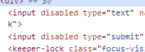

## 📌 Description du challenge
Un formulaire est présent sur la page, mais il est impossible d’interagir avec les champs d’entrée. Le but est de trouver un moyen de contourner cette restriction.

## 🚀 Méthode d'attaque
1. **Inspection du code source** :  
   - Ouvrir les outils de développement du navigateur (`F12` ou `Ctrl + Shift + I`).
   - Localiser les champs d’entrée désactivés (`disabled`).
   

2. **Modification du code HTML** :  
   - Supprimer l’attribut `disabled` dans le code HTML.
   - Valider le formulaire avec n’importe quelle entrée.

## 🔍 Analyse Blue Team
### 🔹 Détection :
- Surveiller les modifications DOM effectuées via les outils de développement.
- Activer des alertes en cas de soumission suspecte de formulaire désactivé.

### 🔹 Prévention :
- Implémenter des vérifications côté serveur pour empêcher la soumission de champs normalement désactivés.
- Utiliser JavaScript pour réactiver dynamiquement les champs seulement pour les utilisateurs authentifiés.

### 🔹 Réaction :
- Journaliser toute tentative d’interaction avec un formulaire désactivé.
- Bloquer les soumissions suspectes et avertir les administrateurs.

