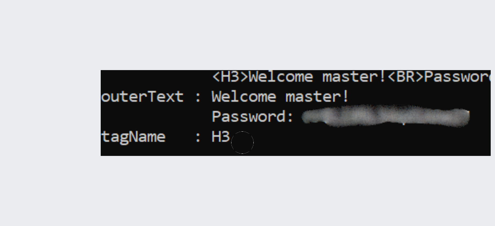

## Challenge : HTTP User-Agent  
Ce challenge consiste à contourner une restriction basée sur l'User-Agent du navigateur.  

## Méthode d'attaque  
L'application refuse l'accès si le User-Agent ne correspond pas à celui d'un administrateur. En modifiant ce dernier, nous obtenons une réponse contenant un mot de passe.  

### Pseudo-code de l'attaque  
```plaintext
1. Effectuer une requête HTTP vers l’URL cible.  
2. Spécifier un User-Agent particulier (ex. "admin").  
3. Récupérer et analyser la réponse du serveur.  
4. Identifier toute information sensible retournée.  
```

(Le mot de passe a été flouté pour éviter la divulgation de la réponse.)



## Analyse Blue Team  

### 🔹 Détection :  
- Surveiller les requêtes avec des User-Agents inhabituels dans les logs du serveur. 
- Comparer les User-Agents utilisés avec ceux d’une liste blanche autorisée.  

### 🔹 Prévention :  
- Ne pas se baser uniquement sur l’User-Agent pour l’authentification
- Implémenter des mécanismes d’authentification robustes et complémentaires.  

### 🔹 Réaction :  
- Bloquer les User-Agents suspects et alerter la sécurité.  
- Ajouter des mécanismes de vérification multi-facteurs pour l’accès admin.  
